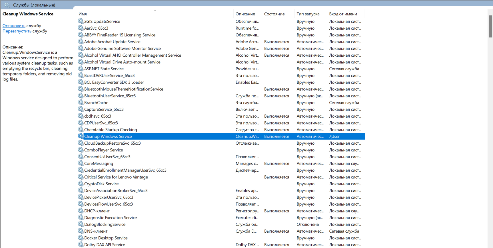
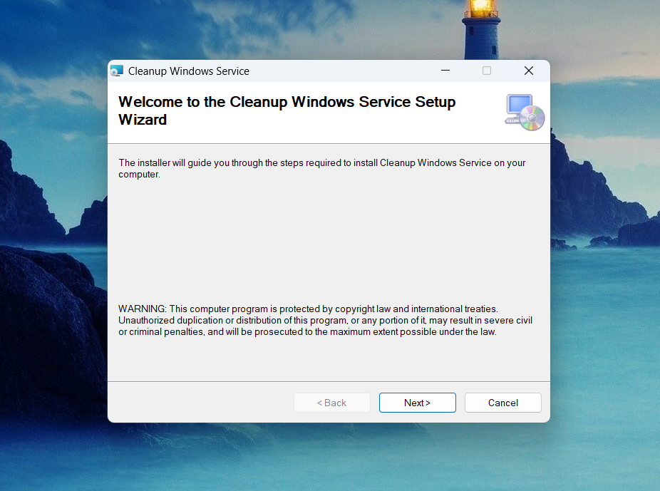
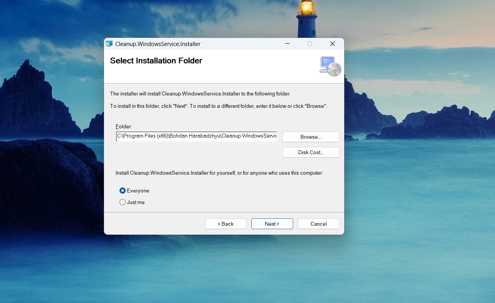
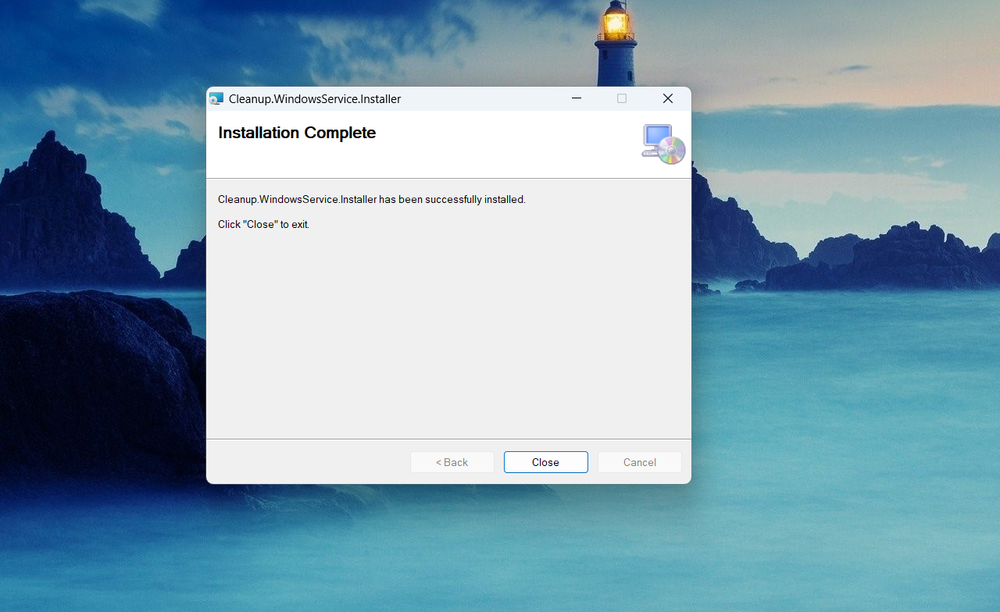
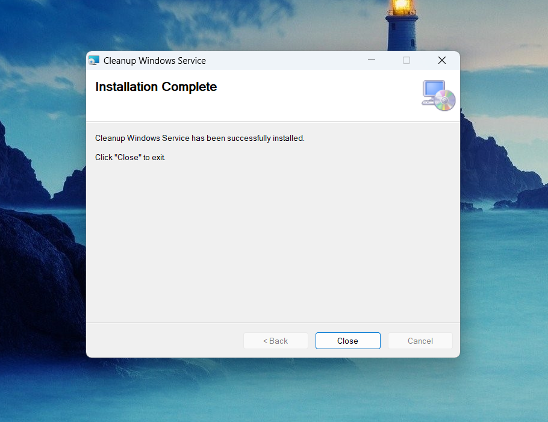
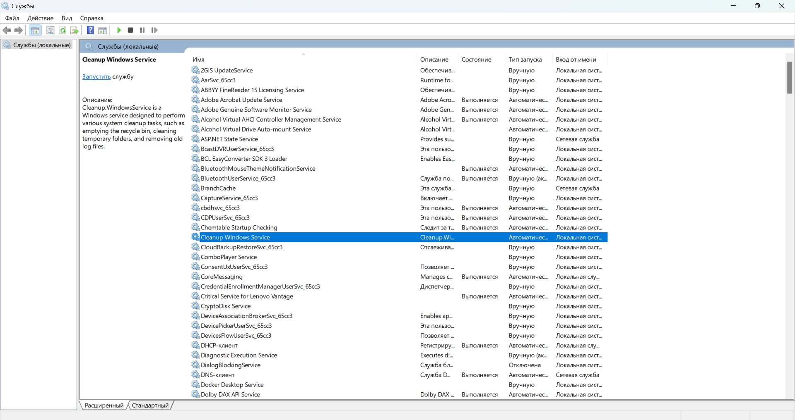
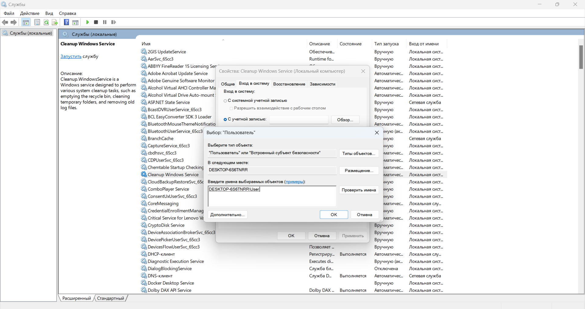
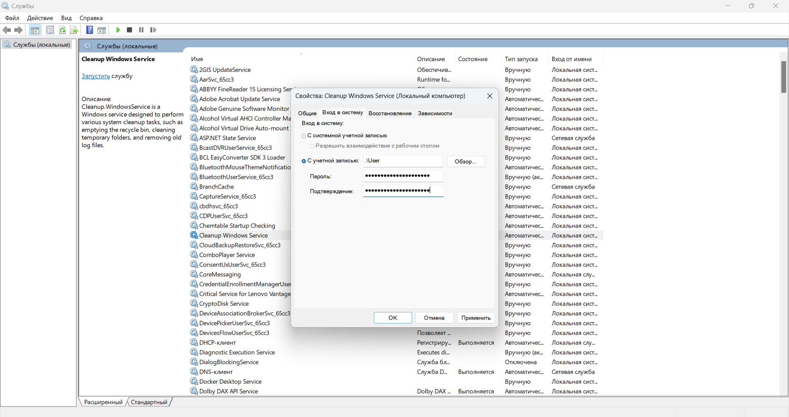

# Cleanup.WindowsService

Cleanup.WindowsService is a Windows service designed to perform various system cleanup tasks, such as emptying the recycle bin, cleaning temporary folders, and removing old log files. This service helps maintain system performance and free up disk space by regularly cleaning up unnecessary files.

## Features

- Empty the recycle bin
- Clean temporary folders
- Clean the Downloads folder
- Clean the Prefetch folder
- Clean Windows temporary folder
- Clean log files
- Clean event logs
- Clean old files (`*.old`, `*.bak`, `*.tmp`)
- Clean trace files (`*.trace`)
- Clean cookies
- Clean remnant driver files
- Reset DNS resolver cache

## Installation

1. Install the service using the provided installer:
   - Run `setup.exe` as an administrator to install the service.

2. After installation, open the Services management console:
   - Press `Win + R`, type `services.msc`, and press `Enter`.

3. In the Services management, find `Cleanup Windows Service`.

4. Right-click on the service and select Properties.

5. Go to the Log On tab. Select This account. Enter the username and password of the account you want the service to run under. Click OK.

6. Go back to the General tab. Click Start to start the service.

## Usage

The service runs as a background service and performs cleanup tasks at regular intervals (next cleanup scheduled in 12 hours). The main cleanup tasks include:

### System Maintenance
- Emptying the recycle bin
- Cleaning temporary folders
- Cleaning prefetch folder
- Resetting DNS resolver cache
- Running DISM cleanup operations
- Running system file checker
- Managing system restore points
- Cleaning Windows update cache
- Cleaning log files and event logs
- Cleaning memory dump files

### File System Cleaning
- Cleaning downloads folder (files older than retention setting)
- Cleaning old files (*.old, *.bak, *.tmp)
- Cleaning trace files
- Cleaning thumbnail cache

### Browser Cleanup
- Cleaning Chrome browser cache
- Cleaning Firefox browser cache
- Cleaning Internet Explorer temporary data

### Logs and Monitoring
Logs are saved in multiple locations:

- File Logs: Located in %USERPROFILE%\Documents\CleanupWindowsService\logs
- Console Output: When running the service in interactive mode

## Troubleshooting
### Common Issues

Service fails to start

- Check if .NET Runtime is installed
- Verify the service account has proper permissions
- Check log files for detailed error messages

Cleanup tasks not completing

- Some files may be locked by other processes
- The service may not have adequate permissions
- Check logs for specific error details

## Contributions

We welcome contributions from the community. If you have a command you'd like to add, feel free to open a pull request.

## Author

Bohdan Harabadzhyu

## License

[MIT](https://choosealicense.com/licenses/mit/)

## YouTube Review

📺 Watch Video Review

