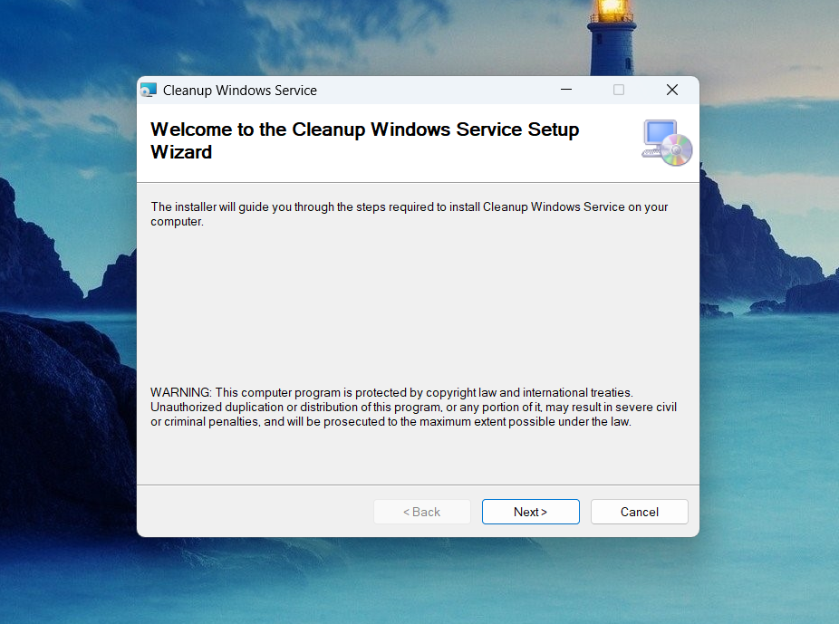
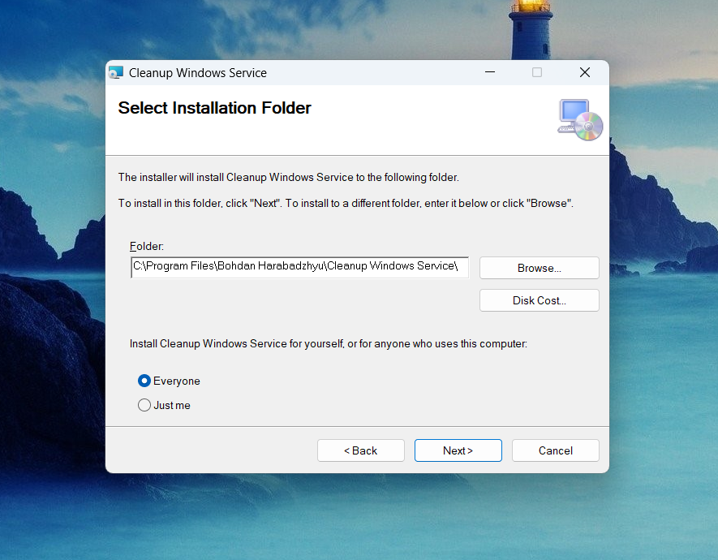

# Cleanup.WindowsService

Cleanup.WindowsService is a Windows service designed to perform various system cleanup tasks, such as emptying the recycle bin, cleaning temporary folders, and removing old log files. This service helps maintain system performance and free up disk space by regularly cleaning up unnecessary files.

## Features

- Empty the recycle bin
- Clean temporary folders
- Clean the Downloads folder
- Clean the Prefetch folder
- Clean Windows temporary folder
- Clean log files
- Clean event logs
- Clean old files (`*.old`, `*.bak`, `*.tmp`)
- Clean trace files (`*.trace`)
- Clean cookies
- Clean remnant driver files
- Reset DNS resolver cache
- Run System File Checker

## Installation

1. Install the service using the provided installer:
   - Run `Cleanup.WindowsService.Installer.msi` to install the service.

2. After installation, open the Services management console:
   - Press `Win + R`, type `services.msc`, and press `Enter`.

3. In the Services management, find `Cleanup Windows Service` and start the service.

## Usage

The service runs as a background service and performs cleanup tasks at regular intervals (once a day). The main cleanup tasks include:

- Emptying the recycle bin
- Cleaning various system folders
- Removing old and temporary files
- Resetting DNS cache
- Running System File Checker

## Contributions

We welcome contributions from the community. If you have a command you'd like to add, feel free to open a pull request.

## Author

Bohdan Harabadzhyu

## License

[MIT](https://choosealicense.com/licenses/mit/)
